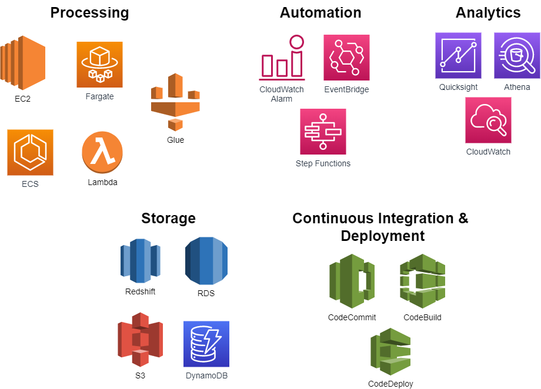

# Introduction

Designing a deployment solution for your application is a critical part of building a well-architected application on AWS. Based on the nature of your application and the underlying services that it requires, you can use AWS services to create a flexible deployment solution that can be tailored to fit the needs of both your application and your organization.

The constantly growing catalog of `AWS services` not only complicates the process of deciding which services will compose your application architecture, but also the process of deciding how you will create, manage, and update your application. When designing a deployment solution on `AWS`, you should consider how your solution will address the following capabilities:

- `Provision` - Create the raw infrastructure or managed service infrastructure required for your application.

- `Configure` - Customize your infrastructure based on environment, runtime, security, availability, performance, network or other application requirements.

- `Deploy` - Install or update your application components onto infrastructure resources and manage the transition from a previous application version to a new application version.

- `Scale` - Proactively or reactively adjust the amount of resources available to your application based on a set of user-defined criteria.

- `Monitor` - Provide visibility into the resources that are launched as part of your `application architecture`. Track resource usage, deployment success or failure, application health, `application logs`, `configuration drift`, and more.

## AWS Deployment Services

The task of designing a scalable, efficient, and cost-effective deployment solution should not be limited to how you will update your application version, but should also consider how you will manage supporting infrastructure throughout the complete application lifecycle. 
`Resource provisioning`, configuration management, application deployment, software updates, monitoring, access control, and other concerns are all important factors to consider when designing a deployment solution.

AWS services can provide management capabilities for one or more aspects of your `application lifecycle`. Depending on your desired balance of control (manual management of resources) versus convenience (AWS management of resources) and the type of application, these services can be used on their own or combined to create a feature-rich deployment solution.

This section will provide an overview of the `AWS services` that can be used to enable organizations to more rapidly and reliably build and deliver applications.

- AWS CloudFormation
- AWS Elastic Beanstalk
- AWS CodeDeploy
- Amazon Elastic Container Service
 
- Amazon Elastic Kubernetes Service
- AWS App Runner
- Amazon Lightsail
- Red Hat OpenShift Service on AWS
- AWS Local Zones
- AWS Wavelength
- Additional Deployment Services

## Additional Deployment Services

[Amazon Simple Storage Service](https://aws.amazon.com/s3/) (Amazon S3) can be used as a web server for static content and single-page applications (SPA). 

Combined with Amazon CloudFront to increase performance in static content delivery, using Amazon S3 can be a simple and powerful way to deploy and update static content. More details on this approach can be found in Hosting Static Websites on AWS whitepaper.

# 1. AWS Proton

AWS Proton is a fully managed service that simplifies and automates the process of deploying and managing microservices and container-based applications. It provides a unified and consistent deployment experience that integrates with popular DevOps tools and services, making it easier to manage and streamline application development. 

# 2. AWS App2Container
AWS App2Container is a command line tool for migrating and modernizing Java and .NET web applications into container format. App2Container analyzes and builds an inventory of applications running in bare metal, virtual machines, Amazon EC2 instances, or in the cloud.

# 3. AWS Copilot

AWS Copilot is a command line interface (CLI) that you can use to quickly launch and manage containerized applications on AWS. It simplifies running applications on Amazon ECS, Fargate, and App Runner. AWS Copilot currently supports Linux, macOS, and Windows systems

# 4. AWS Serverless Application Model

The AWS Serverless Application Model (`AWS SAM`) is an open source framework for building serverless applications. It provides shorthand syntax to express functions, APIs, databases, and event source mappings. With just a few lines per resource, you can define the application you want and model it using YAML. During deployment, SAM transforms and expands the `SAM` syntax into AWS CloudFormation syntax, enabling you to build serverless applications faster.

The `AWS SAM CLI` is an open source command-line tool that makes it easy to develop, test, and deploy serverless applications on AWS. It is a command-line interface for building serverless applications using the AWS SAM specification, which is an extension of AWS CloudFormation.

The AWS SAM CLI enables developers to define and test their serverless applications locally before deploying them to AWS. It provides a local testing environment that simulates `AWS Lambda` and `API Gateway`, enabling developers to test their code and configurations before deploying them to the cloud.

The AWS SAM CLI also includes a variety of helpful features, such as automatic code deployment, `logging`, and debugging capabilities. It enables developers to build, package, and deploy their applications with a `single command`, reducing the time and effort required to deploy and manage serverless applications.

Additionally, the AWS SAM CLI provides support for various programming languages, including `Node.js`, Python, Java, and `.NET Core`, among others. This allows developers to use their preferred programming language and tools to build and deploy their serverless applications.

AWS SAM CLI integrates with other AWS services, such as AWS CodePipeline and AWS CodeBuild, to provide a fully automated and integrated `CI/CD pipeline` for serverless applications. It also enables developers to use other AWS services, such as `Amazon S3`, `Amazon DynamoDB`, and Amazon SNS, as part of their serverless applications.